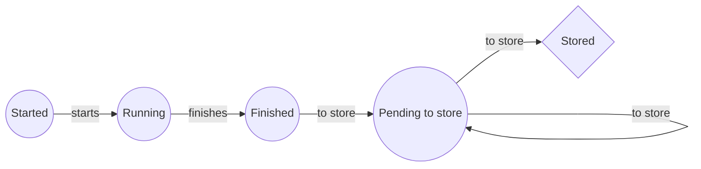

# Go Code Challenge

## How to build

### Fetch dependencies
All dependencies has been vendored and git tracked under the `vendor` repository. 
The vendoring tool used is  `glide`.

Optionally, install all dependencies using glide:
```
glide install
```

### Build
Build linux
```
make build
```

Build Mac
```
make build-darwin
```


Run Linux:
```
build/app
```

Run Mac:
```
build/app.darwin
```

## How is everything implemented

### App Architecture
Packages
- main: Controls the mainloop of the application and the webserver API
- domain: Defines the object domain for this application
- controller: Defines controllers than run asynchronous. Singleton controllers
- journey: Special controller that is created for every received journey.
- metrics: Defines and updates internal metrics
- service: Contains services used across the application
- storage: Storage drivers. Only stdout is implemented.
- utils: Extra utils

### Algorithm
Once a journey has been received though the HTTP API (or directly through a channel) a new Journey Controller is created.
 Journey Controller can:
 - Start
 - Finish
When it starts, it waits (Mocked as `Sleep()` ) and then Finish() is called and emits a signal through a shared channel.
The `Store controller` captures the signal and saves temporary into a `Priority Queue` (Check Priority Queue chapter)
Using the PriorityQueye, it will use the `storage driver` when it corresponds.

A Journey can be in the states:



### Priority Queue
It has been implemented using `container/heap` in the golang package.
It is accesed though a `Queue Service` which must implement:

- Push(): Pushes an element to the queue. The complexity is `O(log(n))` where n = h.Len
- Pop(): Get and remove the element with less priority from the queue. The complexity is `O(log(n))` where n = h.Len
- Get(): Get without removing the element will less priority from the queue. The complexity is `O(1)` 
- Len(): Gives the length of the Queue. The complexity is `O(1)` 

More information:
> https://golang.org/pkg/container/heap/

We have implemented an in-memory single-instance priority queue. If we needed to **scalate** we could use a distributed priority queye (`Redis`, `Kafka`, etc).

Implementation would be quite easy, as we just need to create an other Queue Service that implements the correct Interface.
 
 ### Store controller
 This is where storing of Journeys happens
 It uses a bunch of services:

- queue
- metrics
- storage

And receives signals through the  `finished` everytime a journey finishes and  emits a signal thorugh `AllStoredChannel` everytime the queue of journeys to store is empty (no more pending journeys)

Available configuration:

|Parameter|Description  |  
|--|--|
| OnlyHighest | (bool) Only stores the journey with highest cardinality |
| Storge Driver | (storage.Interface) Which storage Driver to use |

 Example:
```
storageDriver  = storage.NewStdoutStorage()
storeController  := storecontroler.Instance(storecontroler.StoreConfig{
	Channel: finished,
	OnlyHighest: true,
	AllStoredChannel: allStored,
	StorageDriver: storageDriver,
})

storeController.Start()
```

### Metrics
These are the defined metrics inside the application.
Also, these metrics are exported as `Prometheus Metrics` prometheus official client lib. 
Defined metrics can be found on the `metrics` package (`metrics/metrics.go`)

| Name | Type | Description |
|--|--|--|
| journeys_stored | counter | Stored journeys count |
| journeys_finished | counter  | Finished journeys count  |
| journeys_started | counter | Started journeys count |
| journeys_running | gauge | Number of journeys running at the momment |
| journeys_pending | gauge | Number of journeys waiting to be stored |
| journeys\_highest\_received_id | gauge  | ID if the highest received journey |
| journeys\_last\_stored_id | gauge | ID of the highest stored journey |
| journeys_received | counter | Number of received journeys |
| http\_200\_count | counter | HTTP 200 count of the API |
| http\_400\_count |counter  | HTTP 400 (Bad request) count of the API |
|  |  |  |

Additionally these metrics could be also be implemented easily

| Name | Type | Description |
|--|--|--|
| journey_duration | bucket | bucket with the duration of the joruneys |
| journey_wait_time | bucket | Time until journeys are stored since they finished |

### HealthCheck
App healthcheck implemented is very simple. Just checks that the process is running and gives a correct response. 
But, more intelligent healthcheck could be implemented with the metrics we are already collecting:

 - Difference of received journeys and started. If it is different to `zero` it could through a `500` http code in order not to receive more journeys.
 - Time for waiting for a journey to be stored is to high, don't receive more journeys in this case.
 - Too many journeys running. Don't accept more.

### Building and deploying
`Makefile` for building has been provided, also  `Dockerfile` and `Kubernetes` definitions (k8s directory).

### Unit testing
For unit testing, `testify` lib has been used.
> https://github.com/stretchr/testify

### Horizontal Scaling
To scale we would need a distributed implementation of the priority queue (`Redis` for example). Then we could add as many replicas of the application as the priority queue accepts.

The version provided in this implementation only accepts `Vertical scaling`.


